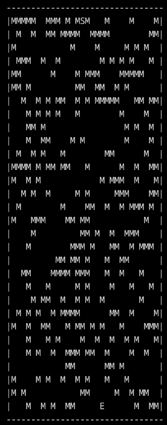
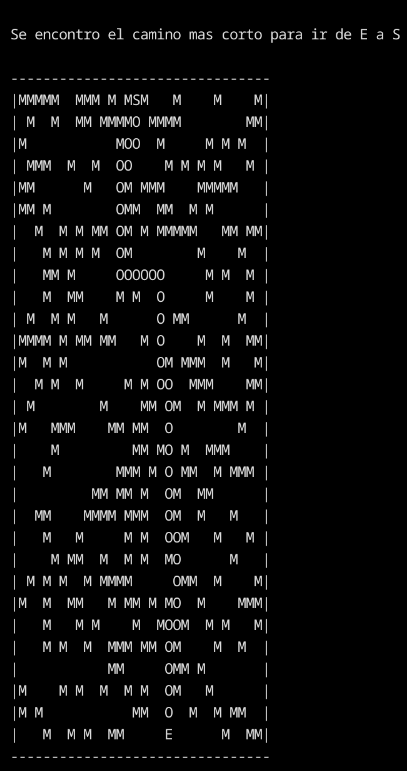
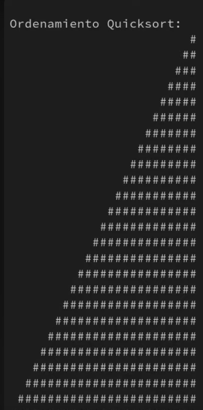

# Portfolio

Welcome to my programming portfolio! This repository showcases various projects I've developed, with several inspired by mathematical concepts. For additional mathematics and machine learning resources, check out my [Knowledge repository](https://github.com/UlteriorCoast18/Conocimiento).

---

## 🎯 Projects by Language

### 🔷 C Programming

#### **Dijkstra's Labyrinth Solver**
*Implementation of Dijkstra's algorithm that generates random labyrinths and finds optimal paths between entrance and exit.*



*Example: Generated labyrinth with solution path highlighted by the letter `O`, letters `E` and `S` represent the entrance and exit, respectively*



#### **Visual Sorting Algorithms**
*Visual demonstration of various sorting algorithms inspired by [15 Sorting Algorithms in 6 Minutes](https://www.youtube.com/watch?v=kPRA0W1kECg).*

<p align="center">
  <a href="https://youtube.com/shorts/Nq1iBdsA_98?feature=share">
    
  </a>
</p>

*Click image to watch the full demo video*

### ☕ Java

#### **Distributed Chess Game**
*Networked chess application enabling two players to compete across different computers via LAN.*


*Features: Real-time move validation, game state synchronization, and chat functionality*

### 🐍 Python

#### **Book Worm** 📚
*Digital library management system with intelligent book recommendations.*

#### **Booklet Project** 
*PDF generation and document processing toolkit.*

#### **Rubik's Cube Solver** 🧊 
*3D visualization of Rubik's Cube with machine learning integration for automated solving.*
*🚧 Work in Progress*

---

## 🤖 Machine Learning

### **Perceptron Classifier**
*Basic neural network implementation for flower classification based on petal dimensions.*


*Classification results on iris dataset*

### **Adaline Network**
*Advanced classifier similar to perceptron with different activation function for improved accuracy.*

---

## 🛠️ Technologies Used

```python
# Example code snippet
languages = ["C", "Java", "Python"]
concepts = ["Algorithms", "Networking", "Machine Learning", "Computer Vision"]
```

📫 Contact
💡 Interested in collaboration? Feel free to reach out!

Email: cristo.daniel.alvarado@gmail.com
GitHub: [UlteriorCoast18](https://github.com/UlteriorCoast18/)
